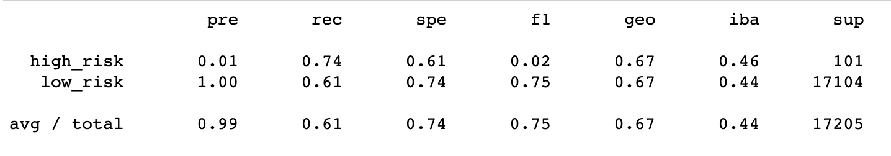
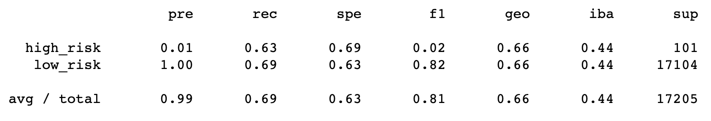
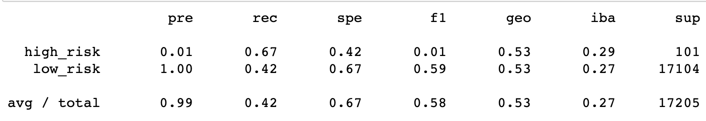
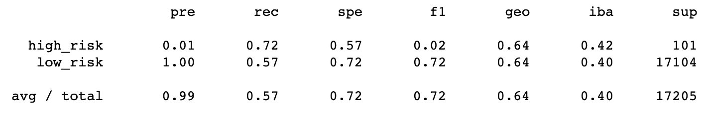
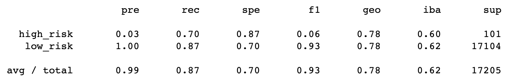
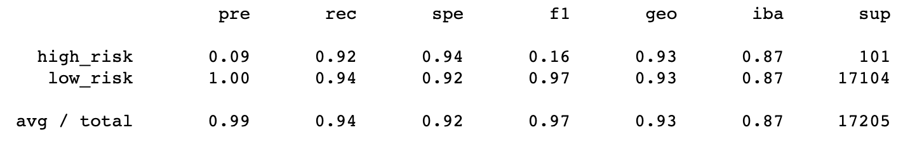

# Credit_Risk_Analysis

## Purpose
The purpose of this analysis was to evaluate the performance of supervised machine learining models in predicting credit card risk. 

## Results
Model #1: RandomOverSampler
1. Balanced accuracy score: 0.6742571941946299
2. Precision score
3. Recall score

Model #2: SMOTE Oversampling
1. Balanced accuracy score: 0.6623356588465208
2. Precision score
3. Recall score

Model #3: ClusterCentroids Uncersampling
1. Balanced accuracy score: 0.544392082449592
2. Precision score
3. Recall score

Model #4: SMOTEENN Over and Under Sampling
1. Balanced accuracy score: 0.6447701423556762
2. Precision score
3. Recall score

Model #5: Balanced Random Forest Classifier
1. Balanced accuracy score: 0.7885466545953005
2. Precision score
3. Recall score

Model #6: Easy Ensemble AdaBoost Classifier
1. Balanced accuracy score: 0.9316600714093861
2. Precision score
3. Recall score

low precision = large number of false positives 
Recall is the ability of the classifier to find all the positive samples. A low recall is indicative of a large number of false negatives
